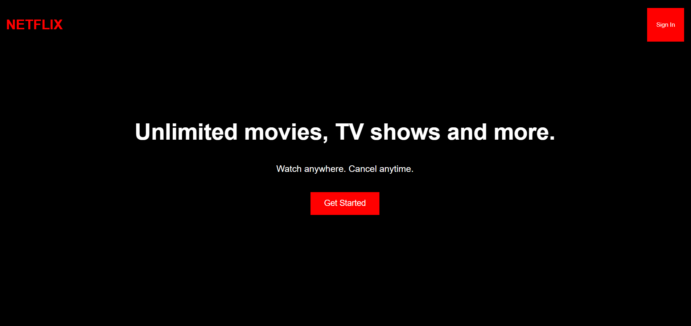

# Netflix Landing Page Clone

## Description
This project is a Netflix landing page clone built using HTML and CSS. It recreates the visual layout of the Netflix homepage with a navigation header, hero section,
and call-to-action buttons. The main goal of this project is to practice front-end development concepts such as page layout, styling, and responsive design using 
pure HTML and CSS.

## Preview

## Features
- Netflix style landing page layout
- Navigation bar with logo and sign in button
- Hero section with title and call to action
- Clean and modern UI design
- Styled using pure CSS

## Technologies Used
- HTML
- CSS
